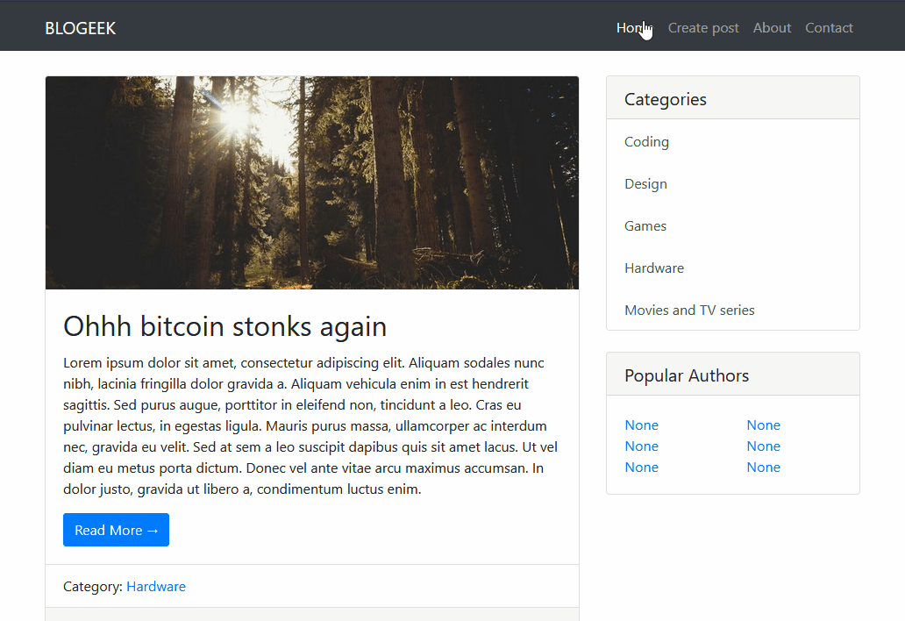

# Blogeek

Simple portal for blogging.

## Functionality



You can:

- Get all posts
- Sort by category
- Add posts

## Project structure

```
bogeek/
├── blog_portal
│   ├── blogeek
│   │   ├── admin.py
│   │   ├── apps.py
│   │   ├── forms.py
│   │   ├── __init__.py
│   │   ├── migrations
│   │   │   └── __init__.py
│   │   ├── models.py
│   │   ├── templates
│   │   │   └── blogeek
│   │   │       ├── add_posts.html
│   │   │       ├── category.html
│   │   │       ├── home_blog_posts.html
│   │   │       ├── index.html
│   │   │       └── view_blogposts.html
│   │   ├── templatetags
│   │   │   ├── blogposts_tags.py
│   │   │   └── __init__.py
│   │   ├── tests.py
│   │   ├── urls.py
│   │   └── views.py
│   ├── blog_portal
│   │   ├── asgi.py
│   │   ├── __init__.py
│   │   ├── settings.py
│   │   ├── urls.py
│   │   └── wsgi.py
│   ├── db.sqlite3
│   ├── manage.py
│   └── templates
│       ├── base.html
│       └── inc
│           ├── _nav.html
│           └── _sidebar.html
├── README.md
└── requirements.txt
```

## URLs

| route                       | description           |
| --------------------------- | --------------------- |
| /                           | Home page (all posts) |
| category/<int:category_id>/ | Posts by category     |
| posts/<int:pk>/             | Single post page      |
| posts/add-posts/            | Add post page         |

## Installation

```
$ git clone https://github.com/aderny-twc/blogeek.git
$ cd blogeek
$ python -m venv venv
$ source /venv/bin/activate
(venv) pip install -r requirements.txt
```

## Application launch

```
(venv) cd blog_portal
(venv) python manage.py runserver
```

Runs at localhost address `http://127.0.0.1:8000/`